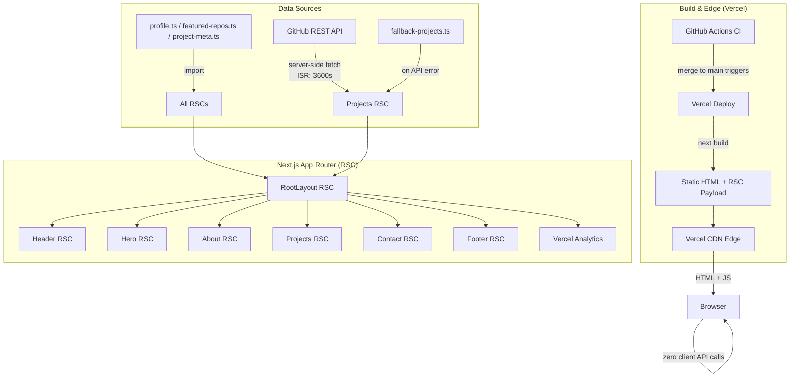
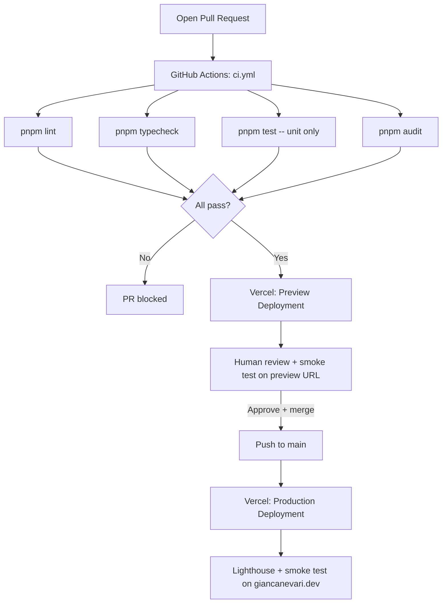

# Architecture: Personal Portfolio — Gian Canevari

> Generated: 2026-06-25
> Stack: Next.js 15 (App Router) · TypeScript · Tailwind CSS · shadcn/ui · Vercel

---

## 1. System Overview

This is a single-page, statically-generated personal portfolio site with no backend, no database, and no auth. All content is stored in version-controlled TypeScript data files. The only external data source is the GitHub REST API, which is called server-side at build time (and re-fetched via Incremental Static Regeneration every 3600 seconds). The compiled HTML/CSS/JS is served entirely from Vercel's CDN edge network. There are no client-initiated API calls and no secrets ever reach the browser.



---

## 2. API Contract

There are no HTTP API routes exposed by this application. The only "API" is the internal TypeScript function `fetchFeaturedRepos` in `src/lib/github.ts`, which is called exclusively from React Server Components during build/ISR.

### GitHub fetch function contract

```
fetchFeaturedRepos(username: string, featuredNames: string[]): Promise<GitHubRepo[]>
```

**Input**
- `username` — GitHub username string (`"Gpiero19"`, sourced from `profile.ts`)
- `featuredNames` — ordered string array from `src/data/featured-repos.ts`

**Output — `GitHubRepo` type**

| Field | Type | Source | Fallback |
|---|---|---|---|
| `name` | `string` | `repo.name` | none (required) |
| `description` | `string \| null` | `repo.description` | render "No description" in UI |
| `language` | `string \| null` | `repo.language` | omit language badge |
| `stars` | `number` | `repo.stargazers_count` | `0` |
| `url` | `string` | `repo.html_url` | none (required) |

**Fetch order and fallback behaviour**

1. Try live GitHub API call (`GET /users/Gpiero19/repos?per_page=100`)
2. If the call succeeds → filter by `featuredNames` → merge with `project-meta.ts` overrides → return
3. If the call throws (network failure, rate limit, 4xx/5xx) → log error to stdout → load `src/data/fallback-projects.ts` → filter by `featuredNames` → merge with `project-meta.ts` overrides → return
4. The fallback file is maintained manually by the developer and mirrors the `GitHubRepo` shape

**Project meta overlay**

After filtering, each `GitHubRepo` is merged with its corresponding `ProjectMeta` entry (if any) from `src/data/project-meta.ts`:
- `summary` field in `ProjectMeta`, if present, overrides the GitHub `description`
- `caseStudyUrl` field, if present, adds a "Case Study" link to the project card
- Repos with no `ProjectMeta` entry render using raw GitHub data only

**Authentication**

The optional `GITHUB_TOKEN` environment variable is read exclusively through `src/lib/config.ts`. When present, it is added as a Bearer token in the `Authorization` header. It is never passed to any client component and never appears in any rendered output.

**Rate limits**
- Unauthenticated: 60 requests/hour per IP (build server IP)
- Authenticated: 5000 requests/hour
- With ISR at 3600s and a single list call, unauthenticated is sufficient for production traffic. Token is optional but recommended.

---

## 3. Data Architecture

### No database

There is no database. All persistent content is TypeScript files committed to the repository.

### Content data files

| File | Purpose | Shape |
|---|---|---|
| `src/data/profile.ts` | Single source of truth for personal content | `Profile` type |
| `src/data/featured-repos.ts` | Ordered list of repo names to display | `string[]` |
| `src/data/fallback-projects.ts` | Static snapshot of `GitHubRepo`-shaped data for featured repos | `GitHubRepo[]` |
| `src/data/project-meta.ts` | Optional per-project overrides and case study links | `Record<string, ProjectMeta>` |
| `src/data/changelog.ts` | Ordered list of site changelog entries (newest first) | `ChangelogEntry[]` |
| `public/resume.pdf` | Downloadable resume | static binary asset |
| `public/og-image.png` | Open Graph image (1200×630) | static image asset |

**`Profile` type (defined in `src/types/profile.ts`)**

```typescript
interface Profile {
  name: string;            // "Gian Canevari"
  title: string;           // "Software Developer"
  tagline: string;         // one-line tagline
  bio: string;             // 2-3 sentence paragraph
  email: string;           // used for mailto: links
  githubUsername: string;  // "Gpiero19"
  linkedinUrl: string;     // full URL
  resumePath: string;      // "/resume.pdf"
  siteUrl: string;         // "https://giancanevari.dev"
  metaDescription: string; // used in <meta name="description">
  techStack: TechIcon[];   // icons shown in About section
}

interface TechIcon {
  name: string;   // display label
  icon: string;   // icon identifier or SVG import path
}
```

**`GitHubRepo` type (defined in `src/types/github.ts`)**

```typescript
interface GitHubRepo {
  name: string;
  description: string | null;
  language: string | null;
  stars: number;
  url: string;
}
```

**`ProjectMeta` type (defined in `src/types/project-meta.ts`)**

```typescript
interface ProjectMeta {
  summary?: string;       // overrides GitHub description when present
  caseStudyUrl?: string;  // external link or future internal page route
}
```

**`ChangelogEntry` type (defined in `src/types/changelog.ts`)**

```typescript
interface ChangelogEntry {
  date: string;        // ISO date string "YYYY-MM-DD"
  version: string;     // semver string e.g. "1.2.0"
  summary: string;     // one-line description of the change
}
```

The changelog is rendered as a compact timeline in a `Changelog` section on the page. Entries are listed newest-first. The section is positioned after Contact. It demonstrates continuous improvement to recruiters and visitors without requiring a blog or CMS.

### Migration strategy

Not applicable — no database schema exists. Changes to TypeScript data types are enforced by the TypeScript compiler at `pnpm typecheck`. Any structural change to `Profile`, `GitHubRepo`, or `ProjectMeta` will produce a type error before it can be merged.

---

## 4. Auth and Authorization

There is no auth. The site is fully public. Every route is publicly accessible with no login gate.

The `GITHUB_TOKEN` is a server-only secret used to raise the GitHub API rate limit. It is:
- Read exclusively in `src/lib/config.ts`
- Passed only to `src/lib/github.ts` as a function argument
- Never exported from any module imported by a Client Component
- Never rendered in JSX or included in any API response

Next.js App Router enforces this boundary: any file that uses `GITHUB_TOKEN` must never include `"use client"`. If a developer accidentally imports `config.ts` into a client component, Next.js will throw a build error because server-only environment variables (those without the `NEXT_PUBLIC_` prefix) are stripped from the client bundle.

---

## 5. State Management

There is no global client state. The site is a read-only, statically rendered document.

**Rules:**
- All data fetching occurs in React Server Components (RSC) — no `useEffect`, no `useState` for data.
- The only permitted client-side interactivity is UI state that cannot be expressed in HTML alone (e.g., mobile nav open/closed toggle).
- If a mobile nav toggle is needed in the Header, it is extracted into a minimal `NavToggle` Client Component that owns only a single `boolean` state. The surrounding `Header` remains an RSC.
- No global state library (Redux, Zustand, Jotai, etc.) is installed.
- TanStack Query is not used — all data is fetched at build time via RSC.

**Component classification table:**

| Component | Type | Reason |
|---|---|---|
| `RootLayout` | RSC | Wraps everything, no interactivity |
| `Header` | RSC | Static nav links; delegates toggle to child if needed |
| `NavToggle` | Client Component | Mobile menu open/closed state only |
| `Footer` | RSC | Static links |
| `Hero` | RSC | Static content from `profile.ts` |
| `About` | RSC | Static content from `profile.ts` |
| `Projects` | RSC | Fetches GitHub data server-side |
| `ProjectCard` | RSC | Receives props, renders static card |
| `Contact` | RSC | Static links |
| `Changelog` | RSC | Static content from `changelog.ts` |

---

## 6. Infrastructure and Environments

### Environments

| Environment | Trigger | URL | ISR | Notes |
|---|---|---|---|---|
| `dev` | `pnpm dev` locally | `localhost:3000` | disabled (always fresh) | Uses `.env.local` |
| `production` | Merge to `main` | `https://giancanevari.dev` | 3600s | Vercel production deployment |

There is no staging environment. Vercel's automatic preview deployment for each PR serves as an informal staging environment.

### Environment variables

All environment variables are accessed exclusively through `src/lib/config.ts`. No other file may reference `process.env` directly.

| Variable | Required | Environment | Purpose |
|---|---|---|---|
| `GITHUB_TOKEN` | No (optional) | production, dev | GitHub API auth token — raises rate limit |
| `NEXT_PUBLIC_SITE_URL` | Yes | production, dev | Canonical site URL for OG tags and sitemap; value: `https://giancanevari.dev` |

**`src/lib/config.ts` contract:**

```typescript
export const config = {
  githubToken: process.env.GITHUB_TOKEN ?? null,
  siteUrl: process.env.NEXT_PUBLIC_SITE_URL ?? 'http://localhost:3000',
} as const;
```

### Local development setup

Developers create `.env.local` (gitignored) with the above variables. The `.env.example` file (committed) lists all variable keys with empty values and explanatory comments.

### Secrets management

- `GITHUB_TOKEN` is stored in the Vercel project dashboard under Environment Variables (production scope).
- It is never committed to the repository.
- `.env.local` is listed in `.gitignore`.
- CI (GitHub Actions) does not need `GITHUB_TOKEN` — the GitHub API is mocked in unit tests.

---

## 7. External Dependencies

| Service | Purpose | Fallback if down | Timeout | Retry policy |
|---|---|---|---|---|
| GitHub REST API | Fetch repo metadata for Projects section | Serve `fallback-projects.ts` static data — see ADR-012 | 5000ms | No retry — ISR retries on next revalidation (3600s) |
| Vercel | Hosting, CDN, ISR runtime, Analytics | No fallback — single hosting provider | N/A | N/A — Vercel SLA 99.9% |
| `next/font/google` (Geist) | Self-hosted font at build time | Font stack falls back to `system-ui, sans-serif` | N/A (bundled at build time) | N/A |

---

## 8. Async Jobs

There are no async jobs, background workers, queues, or scheduled tasks. The only async operation is the GitHub API fetch, which happens within the Next.js build/ISR pipeline and is handled by `fetchFeaturedRepos` with a catch-all that falls back to static data.

---

## 9. Caching Strategy

### ISR (Incremental Static Regeneration)

| What | Cache location | TTL | Invalidation |
|---|---|---|---|
| Entire page HTML (including GitHub data) | Vercel CDN edge cache | 3600 seconds | Automatic on next request after TTL; also invalidated on every new Vercel deployment |
| Static assets (`/resume.pdf`, `/og-image.png`, fonts) | Vercel CDN | Immutable (content-hashed by Next.js) | New deployment |
| Next.js `Image` optimized images | Vercel image CDN | 60s minimum (Vercel default) | Automatic |

### Next.js `fetch` cache and `unstable_cache`

`fetchFeaturedRepos` wraps its GitHub `fetch` call with Next.js `unstable_cache` (from `next/cache`) to give explicit, named cache control:

```typescript
import { unstable_cache } from 'next/cache';

export const fetchFeaturedRepos = unstable_cache(
  async (username: string, featuredNames: string[]) => { /* ... */ },
  ['github-repos'],
  { revalidate: 3600, tags: ['github'] }
);
```

**Why `unstable_cache` over raw `fetch` with `{ next: { revalidate } }`:**
- Named cache key (`'github-repos'`) makes cache entries explicit and inspectable
- `tags: ['github']` enables on-demand revalidation via `revalidateTag('github')` if ever needed
- The cache lives server-side only — no client-side fetch, no client bundle impact
- Fallback to `fallback-projects.ts` still occurs inside the wrapped function on any error

**Cache behaviour:**
- First request after deployment: fresh GitHub API call
- Subsequent requests within 3600s: served from Next.js data cache (server-side, zero network cost)
- After 3600s: background revalidation triggered on next request (stale-while-revalidate semantics)

---

## 10. SEO Metadata Strategy

All SEO metadata is sourced from `profile.ts` — no strings are hardcoded in `layout.tsx` or `page.tsx`.

### Page title

Format: `"Gian Canevari — Software Developer"` — defined via the Next.js `metadata` export in `src/app/layout.tsx`.

### Meta description

Single value, defined as `profile.metaDescription`, injected into `<meta name="description">` via the `metadata` export.

### Open Graph

| Tag | Value | Source |
|---|---|---|
| `og:title` | "Gian Canevari — Software Developer" | `profile.name + profile.title` |
| `og:description` | Same as meta description | `profile.metaDescription` |
| `og:image` | `https://giancanevari.dev/og-image.png` | `config.siteUrl + "/og-image.png"` |
| `og:url` | `https://giancanevari.dev` | `config.siteUrl` |
| `og:type` | `"website"` | hardcoded |

### Twitter card

| Tag | Value |
|---|---|
| `twitter:card` | `"summary_large_image"` |
| `twitter:title` | Same as `og:title` |
| `twitter:description` | Same as `og:description` |
| `twitter:image` | Same as `og:image` |

### JSON-LD Person structured data

A `<script type="application/ld+json">` block is injected directly in `src/app/layout.tsx` using a server-side rendered `<script>` tag (not a Next.js `metadata` field, as Next.js does not support JSON-LD in the metadata API). All values are sourced from `profile.ts`.

```typescript
// src/app/layout.tsx
const jsonLd = {
  '@context': 'https://schema.org',
  '@type': 'Person',
  name: profile.name,
  jobTitle: profile.title,
  url: config.siteUrl,
  email: profile.email,
  sameAs: [
    profile.linkedinUrl,
    `https://github.com/${profile.githubUsername}`,
  ],
};

// In the JSX:
<script
  type="application/ld+json"
  dangerouslySetInnerHTML={{ __html: JSON.stringify(jsonLd) }}
/>
```

**Note**: SPEC.md originally specified "Structured data: no". The human explicitly requested JSON-LD Person schema as an enhancement. See ADR-014.

### Canonical URL

`https://giancanevari.dev` — defined via `alternates.canonical` in the `metadata` export. `www` is not used; Vercel handles the www-to-non-www redirect if configured.

### Sitemap

Generated by `src/app/sitemap.ts` using Next.js built-in sitemap support. Returns a single entry for the homepage. Accessible at `https://giancanevari.dev/sitemap.xml`.

### Next.js `metadata` API usage

```typescript
// src/app/layout.tsx
export const metadata: Metadata = {
  title: `${profile.name} — ${profile.title}`,
  description: profile.metaDescription,
  openGraph: {
    title: `${profile.name} — ${profile.title}`,
    description: profile.metaDescription,
    url: config.siteUrl,
    images: [{ url: `${config.siteUrl}/og-image.png` }],
    type: 'website',
  },
  twitter: {
    card: 'summary_large_image',
    title: `${profile.name} — ${profile.title}`,
    description: profile.metaDescription,
    images: [`${config.siteUrl}/og-image.png`],
  },
  alternates: {
    canonical: config.siteUrl,
  },
};
```

---

## 11. Analytics

**Tool**: Vercel Analytics (`@vercel/analytics` npm package)

**Install**: `<Analytics />` component added to `RootLayout` in `src/app/layout.tsx` — zero additional configuration required.

**What it tracks**:
- Page views
- Web Vitals: LCP, INP, CLS (reported to Vercel dashboard automatically)

**What it does NOT track**:
- PII (no names, emails, IP addresses)
- Cross-site identifiers or fingerprints
- Cookies (cookieless by design)

**Cookie consent**: Not required. Vercel Analytics is cookieless and does not collect personal data, so it falls outside GDPR consent requirements for this use case. See ADR-011.

---

## 12. Observability

For MVP scope (per SPEC.md), formal observability tooling is limited to Vercel Analytics and stdout logging.

### What is logged

- GitHub API fetch errors are written to `console.error` (captured in Vercel build/function logs) with a structured object: `{ event: 'github_fetch_error', username: 'Gpiero19', error: error.message, timestamp }`
- No PII appears in any log entry (no email addresses, no IP addresses, no tokens)

### Structured log format

```json
{
  "timestamp": "2026-06-25T10:00:00.000Z",
  "level": "error",
  "event": "github_fetch_error",
  "username": "Gpiero19"
}
```

Fields that must never appear in logs: email addresses, IP addresses, tokens, passwords.

---

## 13. Security Baseline

### Security headers

Set via `next.config.ts` `headers()` function, applied to all routes:

| Header | Value |
|---|---|
| `X-Frame-Options` | `DENY` |
| `X-Content-Type-Options` | `nosniff` |
| `Referrer-Policy` | `strict-origin-when-cross-origin` |
| `Permissions-Policy` | `camera=(), microphone=(), geolocation=()` |
| `Content-Security-Policy` | `default-src 'self'; script-src 'self' 'unsafe-inline'; style-src 'self' 'unsafe-inline'; img-src 'self' data: https:; font-src 'self'; connect-src 'none'; frame-ancestors 'none'` |

**Note on CSP**: `'unsafe-inline'` is required for Next.js 15 App Router inline scripts. See ADR-006.

### HTTPS enforcement

Vercel enforces HTTPS automatically. HTTP is redirected to HTTPS at the edge.

### Input validation

Not applicable — there are no user inputs, forms, or dynamic query parameters processed server-side.

### Rate limiting

Not applicable for end-users — the site is fully static HTML from CDN with no dynamic endpoints.

---

## 14. Performance Baseline

All metrics targets are from SPEC.md. Lighthouse score targets are set for production.

### Core Web Vitals targets

| Metric | Target | How achieved |
|---|---|---|
| LCP | < 1500ms | Static HTML from CDN; hero text is plain HTML; Geist font preloaded via `next/font/google` |
| INP | < 200ms | Minimal client JS; no heavy event handlers |
| CLS | < 0.1 | Image dimensions always specified via `<Image width height>`; font display: `swap` |

### Lighthouse score targets

| Category | Target |
|---|---|
| Performance | 95+ |
| Accessibility | 95+ |
| Best Practices | 95+ |
| SEO | 100 |

### Measurement approach

- Primary: manual Lighthouse run in Chrome DevTools against `https://giancanevari.dev` after each production deployment.
- Optional future addition: `lighthouse-ci` in GitHub Actions on PR against the Vercel preview URL.

### Bundle targets

| Resource | Limit | How achieved |
|---|---|---|
| Total JS bundle | < 150kb gzipped | No global state library; shadcn/ui tree-shaken; Client Components minimized |
| Max image size | < 200kb | Next.js `<Image>` converts to WebP/AVIF; `og-image.png` must be < 200kb pre-optimization |

### Image rules

- Every `` tag is forbidden — all images use Next.js `<Image>` component.
- All `<Image>` components must specify `width` and `height` (or `fill`) to prevent CLS.
- Images below the fold use `loading="lazy"` (Next.js default).
- Hero profile photo (if added) uses `priority` prop.

---

## 15. Feature Flags and Rollout

Feature flags are not used (per SPEC.md). Risky changes are managed via feature branches (`task/<name>`), PR review, and Vercel preview deployments.

---

## 16. Rollback Strategy

### Code rollback

Vercel retains all previous deployments. To rollback: open Vercel dashboard → Deployments → select last known-good deployment → Promote to Production. Alternatively, `git revert` the offending commit and push to `main`.

### Data/asset rollback

`git revert <commit>` and push to `main` triggers a new Vercel deployment with the reverted content.

---

## 17. Directory and File Structure

```
personal-website/
├── .claude/
│   └── CLAUDE.md
├── .github/
│   └── workflows/
│       └── ci.yml                    # Lint + typecheck + test + audit on PR
├── public/
│   ├── resume.pdf                    # Downloadable resume
│   └── og-image.png                  # Open Graph image (1200×630)
├── src/
│   ├── app/
│   │   ├── layout.tsx                # RootLayout RSC — font, metadata, Header, Footer, Analytics
│   │   ├── page.tsx                  # Home page RSC — composes all sections
│   │   ├── globals.css               # Tailwind base, CSS custom properties
│   │   └── sitemap.ts                # Next.js sitemap generator
│   ├── components/
│   │   ├── layout/
│   │   │   ├── Header.tsx            # RSC — site name + nav links
│   │   │   ├── NavToggle.tsx         # Client Component — mobile menu state only
│   │   │   └── Footer.tsx            # RSC — copyright + social icon links
│   │   ├── sections/
│   │   │   ├── Hero.tsx              # RSC — name, role, tagline, CTA buttons
│   │   │   ├── About.tsx             # RSC — bio, tech stack icons
│   │   │   ├── Projects.tsx          # RSC — fetches GitHub data, renders grid
│   │   │   ├── Contact.tsx           # RSC — LinkedIn, email, GitHub links
│   │   │   └── Changelog.tsx         # RSC — compact timeline from changelog.ts
│   │   └── ui/
│   │       └── ProjectCard.tsx       # RSC — single repo card (shadcn/ui Card)
│   ├── data/
│   │   ├── profile.ts                # Personal content: name, bio, links, etc.
│   │   ├── featured-repos.ts         # Ordered list of repo names to display
│   │   ├── fallback-projects.ts      # Static GitHubRepo[] snapshot for offline fallback
│   │   ├── project-meta.ts           # Optional per-project overrides keyed by repo name
│   │   └── changelog.ts              # Ordered ChangelogEntry[] newest-first
│   ├── lib/
│   │   ├── config.ts                 # ONLY file that reads process.env
│   │   └── github.ts                 # fetchFeaturedRepos() — GitHub REST API call + fallback
│   └── types/
│       ├── profile.ts                # Profile, TechIcon interfaces
│       ├── github.ts                 # GitHubRepo interface
│       ├── project-meta.ts           # ProjectMeta interface
│       └── changelog.ts              # ChangelogEntry interface
├── tests/
│   ├── unit/
│   │   ├── github.test.ts            # fetchFeaturedRepos with mocked fetch + fallback
│   │   ├── hero.test.tsx             # Hero CTA buttons render + hrefs
│   │   ├── header.test.tsx           # Header nav links render
│   │   └── metadata.test.ts          # OG metadata fields present
│   └── e2e/
│       ├── layout.spec.ts            # Header and footer present
│       ├── hero.spec.ts              # Above-fold screenshot mobile + desktop
│       ├── projects.spec.ts          # Projects section renders cards
│       ├── contact.spec.ts           # Contact links correct hrefs
│       └── changelog.spec.ts         # Changelog section renders at least one entry
├── .env.example
├── .eslintrc.json
├── .gitignore
├── .prettierrc
├── next.config.ts
├── package.json
├── playwright.config.ts
├── tailwind.config.ts
├── tsconfig.json
├── vitest.config.ts
├── SPEC.md
├── ARCHITECTURE.md
└── AGENT_LOG.md
```

---

## 18. CI/CD Flow



**Notes:**
- E2E tests (Playwright) run against `pnpm build && pnpm start` (production build, local server) in CI.
- `pnpm audit` fails CI on high or critical severity vulnerabilities.
- Vercel deployment is triggered automatically by the Vercel GitHub integration.

---

## 19. Architecture Decision Records

### ADR-001: Next.js App Router with React Server Components as the rendering model
**Date**: 2026-06-25 | **Status**: Accepted

**Context**: The site needs server-side GitHub API access (to keep tokens off the client) and maximum static performance.

**Options considered**:
1. Pages Router with `getStaticProps` + ISR
2. App Router with RSC + ISR (fetch revalidation)
3. Pure static export (`next export`) with no ISR

**Decision**: App Router with RSC and Next.js fetch-level ISR (`revalidate: 3600`).

**Consequences**: Server Components are the default; client interactivity requires explicit `"use client"` boundary. ISR means GitHub data is never more than one hour stale without a full redeploy. Trade-off: slightly more complex mental model than Pages Router for contributors unfamiliar with RSC.

---

### ADR-002: No database — all content in TypeScript files
**Date**: 2026-06-25 | **Status**: Accepted

**Context**: Personal portfolio with a small, infrequently-changing content set owned by one person.

**Decision**: TypeScript data files (`profile.ts`, `featured-repos.ts`, `project-meta.ts`). Content changes are made by editing files and pushing to main.

**Consequences**: No CMS UI — content updates require a code commit. TypeScript provides compile-time validation. Eliminates all database infrastructure and GDPR concerns.

---

### ADR-003: Dark mode only — no theme toggle
**Date**: 2026-06-25 | **Status**: Accepted

**Context**: SPEC.md explicitly states "pick one and commit — dark is fine" and lists dark/light mode toggle as out of scope.

**Decision**: Dark mode only. The Tailwind config uses a dark color palette as the single default. No `dark:` variant switching needed.

**Consequences**: Simplifies CSS significantly. Removes any client-side JS for theme detection. Some users who strongly prefer light mode will not have an option — acceptable trade-off for MVP.

---

### ADR-004: Geist font via `next/font/google`
**Date**: 2026-06-25 | **Status**: Accepted

**Context**: SPEC.md allows either Google Fonts or Fontsource. Font family confirmed by the human as Geist (the shadcn/ui ecosystem default, designed by Vercel).

**Decision**: `next/font/google` with the Geist font family. Next.js downloads and self-hosts the font at build time, eliminating any cross-origin request.

**Consequences**: Font is bundled with the deployment. No cross-origin DNS lookup. No GDPR concerns. Geist pairs well with shadcn/ui's design language. Font updates require a redeployment (acceptable).

---

### ADR-005: Single environment variable config module (`src/lib/config.ts`)
**Date**: 2026-06-25 | **Status**: Accepted

**Context**: The codebase has two environment variables. Without a central access point, `process.env` references would be scattered and untestable.

**Decision**: All `process.env` access goes through `src/lib/config.ts`. Every other file imports from `config`.

**Consequences**: Easy to mock in tests. Easy to audit which env vars the application uses. If a variable is missing, the error surface is one file.

---

### ADR-006: `unsafe-inline` in CSP for Next.js 15 App Router
**Date**: 2026-06-25 | **Status**: Accepted

**Context**: Next.js 15 App Router injects inline scripts for hydration and routing. Nonce-based CSP requires middleware and conflicts with the static/ISR rendering model.

**Decision**: Accept `unsafe-inline` in `script-src` and `style-src`. Mitigated by `frame-ancestors 'none'`, `X-Frame-Options: DENY`, and the fact that the site has no user-generated content and no forms (no meaningful XSS attack surface).

**Consequences**: CSP provides reduced protection vs. a nonce-based policy. Acceptable for a read-only portfolio with no user input and no sensitive data.

---

### ADR-007: Vercel free tier as sole hosting provider with no staging environment
**Date**: 2026-06-25 | **Status**: Accepted

**Context**: Personal project with no revenue. Multi-environment infrastructure would add cost and operational overhead.

**Decision**: Two environments only: `dev` (local) and `production` (Vercel). Vercel PR preview deployments serve as informal staging.

**Consequences**: No true environment parity before production. Mitigated by the fully static nature of the site — no environment-specific runtime behavior beyond the site URL.

---

### ADR-008: Playwright E2E tests run against local build, not production
**Date**: 2026-06-25 | **Status**: Accepted

**Context**: E2E tests need a running server. Running against a deployed URL introduces external network dependency in CI.

**Decision**: E2E tests run against `pnpm build && pnpm start` in CI (production build, local server).

**Consequences**: CI time increases by ~30 seconds for `next build`. Tests accurately reflect production behavior. No dependency on external network in CI.

---

### ADR-009: shadcn/ui as the only component library
**Date**: 2026-06-25 | **Status**: Accepted

**Context**: SPEC.md constraint: "shadcn/ui components only — no installing additional component libraries."

**Decision**: shadcn/ui. Components are copied into the repository (not a runtime dependency), making them fully customizable and tree-shakeable.

**Consequences**: Component code lives in `src/components/ui/`. Updating a shadcn component requires re-running `npx shadcn@latest add`. No external component library bundle weight.

---

### ADR-010: GitHub API failure falls back to static `fallback-projects.ts`, not empty array
**Date**: 2026-06-25 | **Status**: Accepted

**Context**: If the GitHub API is down during an ISR revalidation, the projects section must still show content. Returning `[]` would show a "no projects" fallback message, which looks broken to recruiters.

**Options considered**:
1. Return `[]` and render a static fallback message
2. Return data from a manually maintained `fallback-projects.ts` snapshot

**Decision**: On any GitHub API error, `fetchFeaturedRepos` catches the error, logs it to stdout, and loads `src/data/fallback-projects.ts`. The live API result always takes precedence when available. The fallback file is manually maintained by the developer when adding new featured repos.

**Consequences**: The projects section always shows content, even during GitHub API outages. The fallback file requires manual maintenance — a negligible burden given the infrequency of changes. Stale fallback data (e.g., outdated star counts) is acceptable because it is only shown when the API is down.

---

### ADR-011: Vercel Analytics for page views and Web Vitals
**Date**: 2026-06-25 | **Status**: Accepted

**Context**: The human requested analytics tracking. The site has strict privacy requirements (no cookies, no PII, no consent banner).

**Options considered**:
1. Google Analytics — requires cookie consent, tracks PII
2. Plausible / Fathom — privacy-friendly but paid or self-hosted
3. Vercel Analytics — cookieless, zero-config, free on Vercel free tier

**Decision**: Vercel Analytics (`@vercel/analytics`). Installed by adding `<Analytics />` to `RootLayout`.

**Consequences**: Page views and Web Vitals (LCP, INP, CLS) are tracked in the Vercel dashboard. No cookies, no PII, no consent banner required. Data is visible only to the site owner in the Vercel dashboard. Trade-off: data is tied to the Vercel platform — not portable. Acceptable for a personal site on Vercel.

---

### ADR-012: Static fallback projects file for GitHub API outage resilience
**Date**: 2026-06-25 | **Status**: Accepted

**Context**: See ADR-010. This ADR documents the specific design of the fallback mechanism.

**Decision**: `src/data/fallback-projects.ts` exports a `GitHubRepo[]` array that is a static snapshot of the featured repos. It is imported only inside the `catch` block of `fetchFeaturedRepos`. The file must be updated manually whenever the featured repos list changes.

**Consequences**: The fallback is always a `GitHubRepo[]` of the same shape as the live API response, so no conditional rendering logic is needed downstream. The `Projects` RSC and `ProjectCard` are unaware of whether data came from the API or the fallback.

---

### ADR-013: Project meta overlay via `project-meta.ts` for per-project customization
**Date**: 2026-06-25 | **Status**: Accepted

**Context**: The human requested the ability to add custom descriptions and case study links per project without losing the live GitHub data feed.

**Decision**: `src/data/project-meta.ts` exports a `Record<string, ProjectMeta>` keyed by repo name. After fetching (or falling back), `fetchFeaturedRepos` merges each `GitHubRepo` with its `ProjectMeta` entry:
- If `summary` is present, it overrides the GitHub `description` in the card
- If `caseStudyUrl` is present, the `ProjectCard` renders an additional "Case Study" link

Repos with no entry in `project-meta.ts` render using raw GitHub data — the overlay is fully additive.

**Consequences**: Gives the site owner per-project editorial control without a CMS. All content stays in version control and is type-checked at build time. The `ProjectCard` component receives an optional `caseStudyUrl` prop — it must handle the undefined case gracefully (render nothing when absent).

---

### ADR-014: JSON-LD Person structured data despite SPEC.md "no structured data"
**Date**: 2026-06-25 | **Status**: Accepted

**Context**: SPEC.md originally specified "Structured data: no." The human explicitly requested JSON-LD Person schema as a pre-implementation enhancement to improve SEO and Google Knowledge Panel eligibility.

**Decision**: Add a `<script type="application/ld+json">` block in `src/app/layout.tsx` with Schema.org `Person` type. Fields: `name`, `jobTitle`, `url`, `email`, `sameAs` (LinkedIn, GitHub profile). All values sourced from `profile.ts`. The block is rendered server-side as static HTML — no client JS required.

**Why not Next.js `metadata` API**: Next.js 15 does not support JSON-LD via the `metadata` export. The pattern of a server-rendered `<script>` tag with `dangerouslySetInnerHTML` is the officially documented Next.js approach for JSON-LD.

**Consequences**: Improves Google's entity understanding of the site owner. The `email` field in the JSON-LD is not a privacy concern — it is already publicly linked in the Contact section. No additional dependencies required.

---

### ADR-015: `unstable_cache` from `next/cache` for explicit GitHub fetch caching
**Date**: 2026-06-25 | **Status**: Accepted

**Context**: The human requested explicit server-side caching instead of relying on the implicit Next.js `fetch` cache. `unstable_cache` provides named cache keys and tag-based invalidation, which are not available via raw `fetch` with `{ next: { revalidate } }`.

**Options considered**:
1. `fetch` with `{ next: { revalidate: 3600 } }` — implicit, unnamed, no tag support
2. `unstable_cache` wrapper — explicit key, tag support, same TTL semantics

**Decision**: Wrap `fetchFeaturedRepos` with `unstable_cache(['github-repos'], { revalidate: 3600, tags: ['github'] })`. The cache is server-side only; no client impact.

**Consequences**: Cache key `'github-repos'` is named and auditable. Tag `'github'` enables future on-demand revalidation (e.g., via a webhook) without code changes. The API is marked `unstable_` by Next.js but is the established community pattern for non-fetch server caching (e.g., database calls, file reads). Risk is low — the fallback to static data means a cache miss never breaks the page.

---

### ADR-016: Changelog section as a visible site feature
**Date**: 2026-06-25 | **Status**: Accepted

**Context**: The human requested a small changelog section to demonstrate continuous improvement to site visitors (e.g., recruiters).

**Options considered**:
1. CHANGELOG.md in the repo only (not visible on the site)
2. A visible `Changelog` section on the page, data from `src/data/changelog.ts`
3. A separate `/changelog` page

**Decision**: A compact `Changelog` RSC section at the bottom of the single page (after Contact), rendering a timeline of `ChangelogEntry` items from `src/data/changelog.ts`. Entries are ordered newest-first. The section uses a minimal timeline layout (date badge + version + one-line summary).

**Consequences**: Recruiters can see that the portfolio is actively maintained. The data file (`changelog.ts`) is version-controlled and type-checked. No CMS required — the developer adds an entry by prepending to the array and pushing to main. The section is optional in terms of content: if the array is empty, the section renders nothing (or a placeholder). The `Changelog` RSC is always an RSC — no client interactivity needed.
