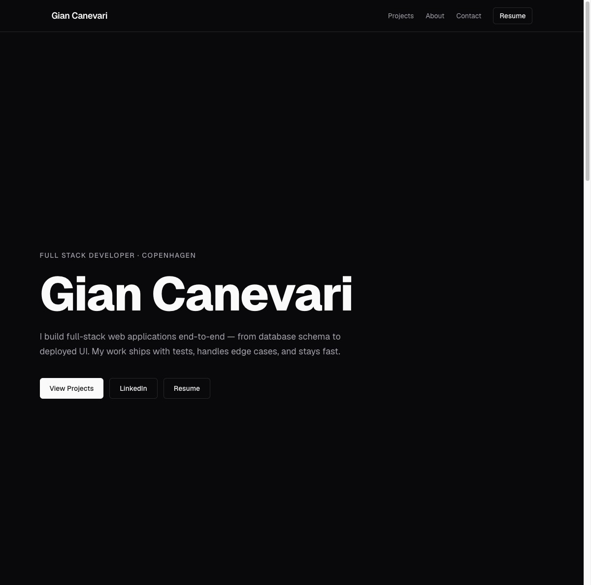

# canevarigian.dev

[](https://github.com/Gpiero19/personal-website/actions/workflows/ci.yml)


Personal portfolio for **Gian Canevari** — Full Stack Developer based in Copenhagen.

**Live:** [canevarigian.dev](https://canevarigian.dev)



---

## What This Project Demonstrates

This portfolio is itself a production-grade Next.js application — not a static site or a template. It was built to the same standard I apply to client work.

| Area | Implementation |
|---|---|
| **Modern React** | React Server Components throughout — zero client-side data fetching for content |
| **Resilient data fetching** | GitHub API with structured error handling and automatic fallback to static data |
| **ISR** | Page-level `revalidate = 3600` — content updates hourly without a redeploy |
| **Testing** | 14 unit tests (Vitest + Testing Library) + Playwright E2E suite |
| **CI/CD** | GitHub Actions runs typecheck, lint, and unit tests on every push |
| **SEO** | JSON-LD structured data, auto-generated `/sitemap.xml`, Open Graph + Twitter cards |
| **Accessibility** | Semantic HTML, ARIA labels, keyboard navigation, `prefers-reduced-motion` |
| **Performance** | 108kb first-load JS, no animation library, CSS-only entrance animations |
| **Security** | Resume hosted on Vercel Blob — never committed to the repository |

---

## Tech Stack

| Layer | Technology |
|---|---|
| Framework | Next.js 15 (App Router) |
| Rendering | React Server Components + ISR |
| Language | TypeScript (strict) |
| Styling | Tailwind CSS v4 + shadcn/ui (zinc dark theme) |
| Font | Geist Sans via `geist` npm package |
| Testing | Vitest + Testing Library · Playwright |
| CI/CD | GitHub Actions |
| Hosting | Vercel |
| File storage | Vercel Blob (resume PDF) |
| Analytics | Vercel Analytics (cookieless, no consent banner required) |

---

## Architecture

Built RSC-first: every component is a server component except the mobile navigation toggle. This eliminates client-side data fetching, removes loading state complexity, and reduces hydration overhead.

**Data flow for the projects section:**

```
GitHub REST API
    └── fetchFeaturedRepos() ← runs server-side at request time
            ├── success → live repo metadata + local projectMeta overlay
            └── error   → fallback-projects.ts (static, always available)
```

The `projectMeta` overlay pattern keeps live GitHub data (stars, language, URL) separate from editorial content (case study, screenshots, live demo link). Updating copy never requires touching the API layer.

**Key decisions:**

**RSC over client fetching** — GitHub data is fetched server-side and streamed as rendered HTML. No `useEffect`, no loading skeletons, no client bundle cost for data access.

**Page-level ISR over `unstable_cache`** — Next.js 15.5.x has a regression where `unstable_cache` with a `tags` option throws `validateTags is not a function` at build time. Page-level `revalidate` achieves the same 1-hour TTL without the bug and without wrapping every fetch.

**CSS-only animations** — entrance animations use `@keyframes fade-up` registered as a Tailwind v4 `--animate-*` token. No Framer Motion, no GSAP. The animation system adds zero bytes to the JS bundle and respects `prefers-reduced-motion` via a single CSS media query.

**Native `<details>/<summary>` for case studies** — expand/collapse without a single line of JavaScript. Keyboard accessible by default, no focus trap to manage, no state to sync.

---

## Project Structure

```
src/
├── app/
│   ├── layout.tsx           # Root layout: font, metadata, JSON-LD, Analytics
│   ├── page.tsx             # Section composition + revalidate export
│   ├── sitemap.ts           # Generates /sitemap.xml at build time
│   └── globals.css          # Tailwind v4 @theme block, @keyframes, base styles
├── components/
│   ├── layout/
│   │   ├── Header.tsx       # Sticky nav + Resume CTA button
│   │   ├── Footer.tsx       # Social icon links
│   │   └── NavToggle.tsx    # Mobile hamburger (only client component in the repo)
│   ├── sections/
│   │   ├── Hero.tsx         # Role label, name, value prop, CTAs
│   │   ├── Projects.tsx     # RSC: fetches GitHub API, maps to ProjectCard
│   │   ├── Experience.tsx   # Work history + education timeline
│   │   ├── About.tsx        # Bio + categorised skill grid
│   │   └── Contact.tsx      # Contact links + work authorization info
│   └── ui/
│       └── ProjectCard.tsx  # Alternating image/content layout, hover, case study
├── data/
│   ├── profile.ts           # Bio, skills, tagline, contact info, meta description
│   ├── featured-repos.ts    # Ordered list of GitHub repo names to display
│   ├── project-meta.ts      # Editorial overlay: titles, case studies, images, URLs
│   ├── fallback-projects.ts # Static fallback when GitHub API is unavailable
│   └── experience.ts        # Work history and education entries
├── lib/
│   ├── github.ts            # fetchFeaturedRepos: fetch → overlay → fallback
│   └── config.ts            # Environment-derived config (siteUrl, githubToken)
└── types/                   # TypeScript interfaces: Profile, GitHubRepo, ProjectMeta…

tests/
├── unit/                    # Vitest + Testing Library (14 tests)
└── e2e/                     # Playwright: hero, projects, contact, layout
```

---

## Author

**Gian Canevari** — [canevarigian.dev](https://canevarigian.dev) · [LinkedIn](https://www.linkedin.com/in/canevarigian/) · [GitHub](https://github.com/Gpiero19)
